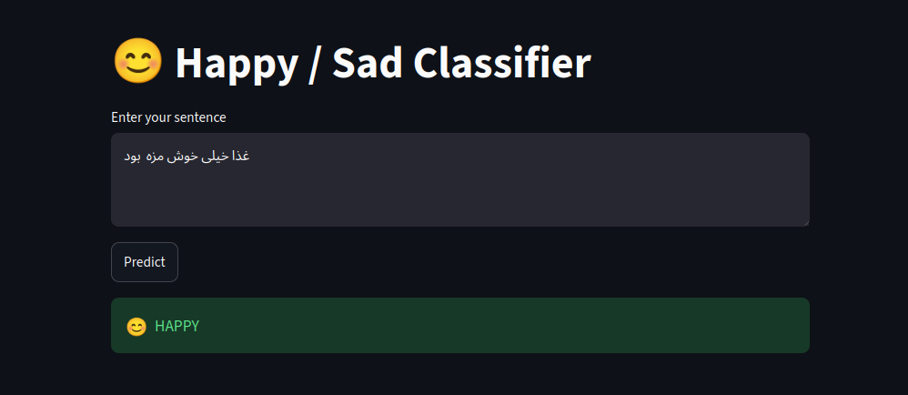
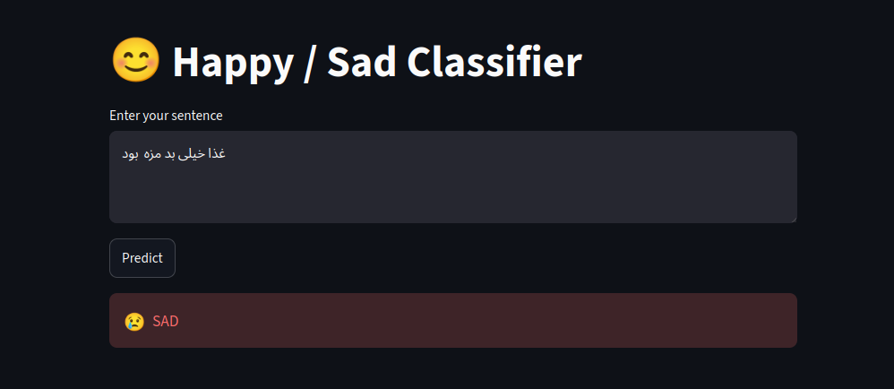

# 🍔 SnapFood Persian Sentiment Analysis

<div align="center">

## 🚀 Live Demo

### Try the deployed application:

### https://snapfood-sentiment-analysis-dikynyqrd4ee5ve6szst8b.streamlit.app/

</div>

---

# 📸 Application Screenshots

## Positive Sentiment Prediction




## Negative Sentiment Prediction



# 📌 Overview

This project is an end-to-end **Persian Sentiment Analysis system** built on SnapFood customer reviews.

The objective is to classify Persian food reviews into two sentiment categories:

* 😊 **HAPPY** (Positive)
* 😞 **SAD** (Negative)

The project covers the complete Machine Learning workflow:

* Data preprocessing
* Persian NLP pipeline
* Feature extraction
* Model training
* Model evaluation
* Model deployment using Streamlit

---

# ⭐ Project Demo

The trained model is deployed as an interactive web application.

Users can enter a Persian customer review and instantly receive sentiment prediction.

🚀 Live Application:

https://snapfood-sentiment-analysis-dikynyqrd4ee5ve6szst8b.streamlit.app/

---

# 🏗️ Project Pipeline

```
Raw Persian Review Text

          ↓

Text Cleaning & Preprocessing

          ↓

Tokenization

          ↓

Feature Extraction

          ↓

Machine Learning Model

          ↓

Sentiment Prediction

          ↓

Streamlit Deployment
```

---

# 🧹 Data Preprocessing

Persian text preprocessing steps:

* Text normalization
* Removing unnecessary characters
* Tokenization
* Cleaning text data
* Preparing tokens for embedding generation

Libraries used:

* Hazm
* NLTK

---

# 🔠 Feature Engineering

Two different approaches were implemented and compared.

## 1. TF-IDF

TF-IDF was used as a traditional text representation method.

Models:

* Logistic Regression
* Linear SVM
* Multinomial Naive Bayes

Results:

| Model               | Accuracy |
| ------------------- | -------: |
| Logistic Regression |      76% |
| Linear SVM          |      75% |
| Naive Bayes         |      77% |

---

## 2. Word2Vec Embeddings

Word2Vec was trained to convert Persian words into numerical vector representations.

Sentence embeddings were created by averaging word vectors.

Models trained using embeddings:

* Logistic Regression
* Linear SVM
* MLP Neural Network

Results:

| Model               | Accuracy |
| ------------------- | -------: |
| Logistic Regression |      80% |
| Linear SVM          |      81% |
| MLP Neural Network  |      78% |

---

# 🏆 Best Model

The best performing model was:

## Linear SVM + Word2Vec Embeddings

Performance:

* Accuracy: ~81%
* F1-score: ~81%

This model was selected and deployed in the Streamlit application.

---

# 🛠️ Technologies

## Programming Language

* Python

## Data Processing

* NumPy
* Pandas

## NLP

* Hazm
* NLTK
* Gensim Word2Vec

## Machine Learning

* Scikit-Learn

Algorithms:

* Logistic Regression
* Linear Support Vector Machine
* MLP Classifier

## Deployment

* Streamlit

---

# 📂 Project Structure

```
snapfood-sentiment-analysis/

│
├── app/
│   └── app.py
│
├── data/
│   ├── train.csv
│   ├── validation.csv
│   └── test.csv
│
├── model/
│   ├── linear_svc.pkl
│   └── word2vec.model
│
├── notebooks/
│   └── notebook.ipynb
│
├── src/
│   ├── preprocessing.py
│   └── tokenization.py
│
├── requirements.txt
└── README.md

```

---

# ⚙️ Run Locally

Clone the repository:

```bash
git clone https://github.com/miladevh/snapfood-sentiment-analysis.git

cd snapfood-sentiment-analysis
```

Create virtual environment:

```bash
python -m venv env

source env/bin/activate
```

Install dependencies:

```bash
pip install -r requirements.txt
```

Run application:

```bash
streamlit run app/app.py
```

---

# 📊 Model Evaluation

Evaluation metrics:

* Accuracy
* Precision
* Recall
* F1-score

The final model achieved balanced performance on both sentiment classes.

---

# 🚀 Deployment

The application is deployed using Streamlit Cloud.

Deployment includes:

* Loading trained Linear SVM model
* Loading Word2Vec embeddings
* Processing user input
* Generating sentence embeddings
* Predicting sentiment

---

# 🔮 Future Improvements

Possible improvements:

* Fine-tuning Persian Transformer models such as ParsBERT
* Using Sentence Transformers embeddings
* Implementing Deep Learning NLP models
* Adding Docker support
* Building REST API using FastAPI

---

# 👨‍💻 Author

Milad

GitHub:
https://github.com/miladevh

